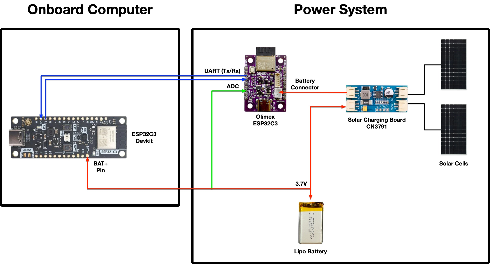

# System overview

2 solar panels connected to solar charging board CN 3791 which is connected to system (VCC & GND) to [Olimex ESP32-C3 (rev. 1)][olimex-esp32-c3] and the [ESP32-C3 Rust dev kit (tag v1.2)][esp32-c3-rust] by [Espressif][espressif]

The output for the battery on the solar charger is connected a switch to disconnect power going towards the battery and then connected to a [LiPo 3.7V battery of 250 mAh][olimex-battery-250mha] ([Datasheet][battery-datasheet]).

On the connection to the battery, there's also a pin for ADC to the Olimex board for taking measurements of the battery. This allows us to read the battery percentage without charging it through the solar charger or USB (e.g. when we're programming the board).

    Charge voltage 4.2V, nominal voltage 3.7V, cut-off voltage 3.0V
    Recommended charge current 50mA
    Max charge current 125mA
    Recommended discharge current 125mA
    Max discharge current 250mA
    Impedance 60mOhm at 1KHz
    Operating temperature: at charge 0-55C, at discharge -25C+60C
    Capacity loss after 500 cycles full charge/discharge at 20C: 20%
    Dimensions 27x21x5mm

[olimex-esp32-c3]: https://www.olimex.com/Products/IoT/ESP32-C3/ESP32-C3-DevKit-Lipo/
[olimex-battery-250mha]: https://www.olimex.com/Products/Power/Lipo-battery/BATTERY-LIPO250mAh/
[battery-datasheet]: https://www.olimex.com/Products/Power/Lipo-battery/BATTERY-LIPO250mAh/resources/JA602025P-Spec-Data-Sheet-3.7V-250mAh--170116.pdf
[esp32-c3-rust]: https://github.com/esp-rs/esp-rust-board/tree/v1.2
[espressif]: https://www.espressif.com/en/products/devkits

## Bill of materials (BOM)

### Components
- 1 x Olimex board (`ESP32-C3-DevKit-Lipo`): https://www.olimex.com/Products/IoT/ESP32-C3/ESP32-C3-DevKit-Lipo/
- 1 x Espressif Rust board (ESP32-C3): https://www.espressif.com/en/products/devkits (`ESP32-C3-DevKit-RUST-1`)
- LiPo Battery - 250 mAh or larger (3.0V cut-off, 3.7V nominal and 4.2V max, with overcharge and over-current protection)
- 2 x Breadboards (Dimensions 82x52x10mm, Power supply bus on top and bottom, Grid on 0.1" step)
- 2 x solar panels (80x80 mm, 6V) with JST-PH 2.0 male connectors (separately soldered)
- 1 x solar charger (CN3791 with 2 solar panel connectors JST-PH 2.0)
  - Includes 2 cables JST-PH 2.0 (male) on both sides

- 2 x JST-PH to 2 pin header connectors for breadboarding

- 2 x resistors (470k Ohms, 1%) - used for the Voltage divider which we use to measure the battery
- 3 x male to male jumper cables - 2 for UART (RX & TX) and 1 for ADC.
- 2 x male to female jumper cables - for powering the Espressif board (BAT+ & GND pins) from the solar charger

- USB-C to USB-B / USB-C to USB-C cable for programming (depends on your development machine)

## Frame
- 5 x M3 L10 bolts
- 5 x M3 nuts
- 1 x 3D printed frame - consists of 3 distinct sides (bottom, front and right)